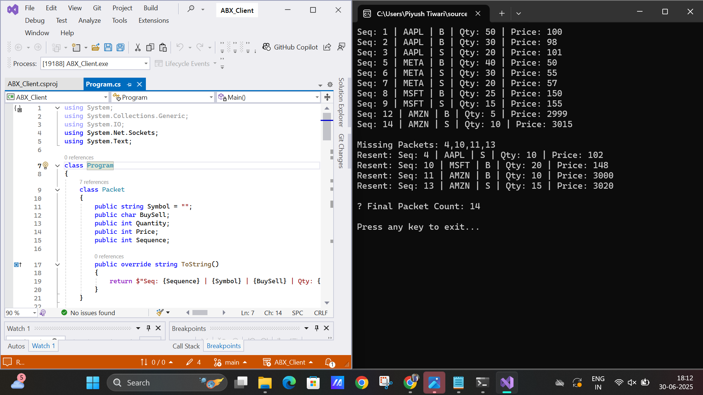

# 📊 ABX Exchange Client

A C# client application for interacting with the ABX Mock Exchange Server over TCP.  
It streams order book data, detects missing packet sequences, and requests specific packets for re-sending.

---

## 🚀 Features

- Connects to the mock ABX Exchange Server using TCP
- Streams order packets using `Stream All Packets` call
- Detects and lists missing packet sequences
- Requests missing packets using `Resend Packet` call
- Displays order book entries with proper formatting

---

## 🧪 Technologies Used

- C# (.NET 8)
- TCP Client Networking
- Byte Parsing (Big Endian)
- Binary Buffer Handling
- JSON (for output formatting)

---

## 🖼️ Output Screenshot



---

## 🔧 How to Run This Project

### 1. Clone the Repository

```bash
git clone https://github.com/piyushtiwari01/abx-exchange-client.git
cd abx-exchange-client